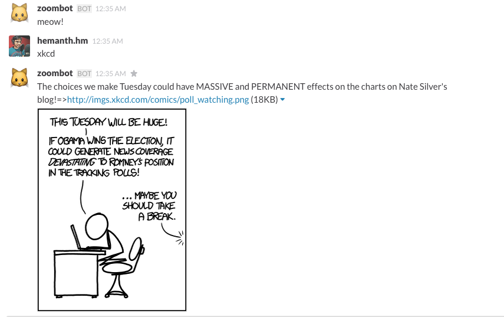

# xkcd-slack-bot [](https://travis-ci.org/hemanth/xkcd-slack-bot)

> XKCD images for slack chats!


## Install

```
$ npm install --save xkcd-slack-bot
```



## Usage

```js
var xkcdSlackBot = require('xkcd-slack-bot');

var auth = {
	token: '<YOUR_BOT_TOKEN>',
	name: '<YOUR_BOT_NAME>',
	channel: '<CHANNEL_NAME>'
};

xkcdSlackBot(data);
```


## API

### xkcdSlackBot(auth)

#### auth
> Object with `name` and `token`

## CLI

```sh

$ xkcd-slack-bot -n <BOT_NAME> -t <TOKEN> -c <CHANNEL_NAME>

```

## License

MIT © [hemanth.hm](http://h3manth.com)
